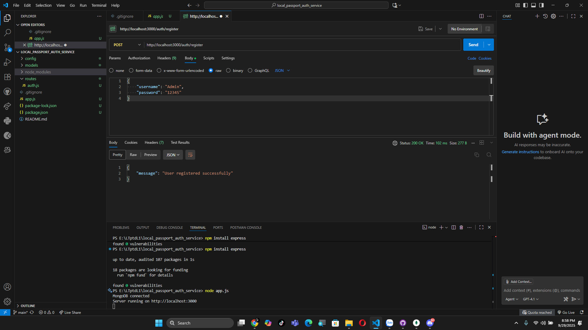
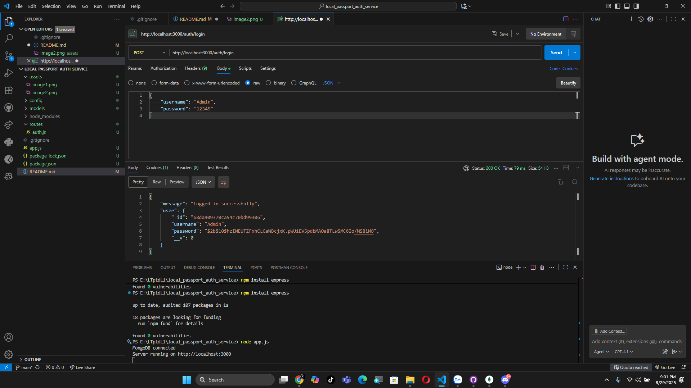
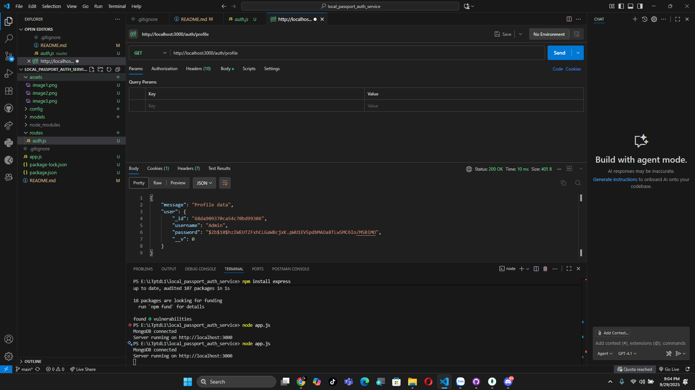
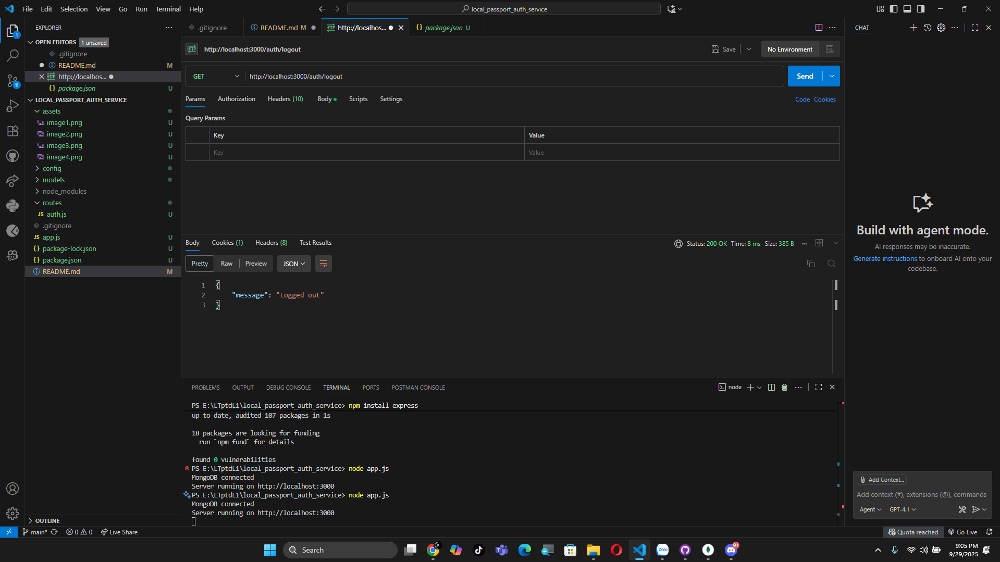
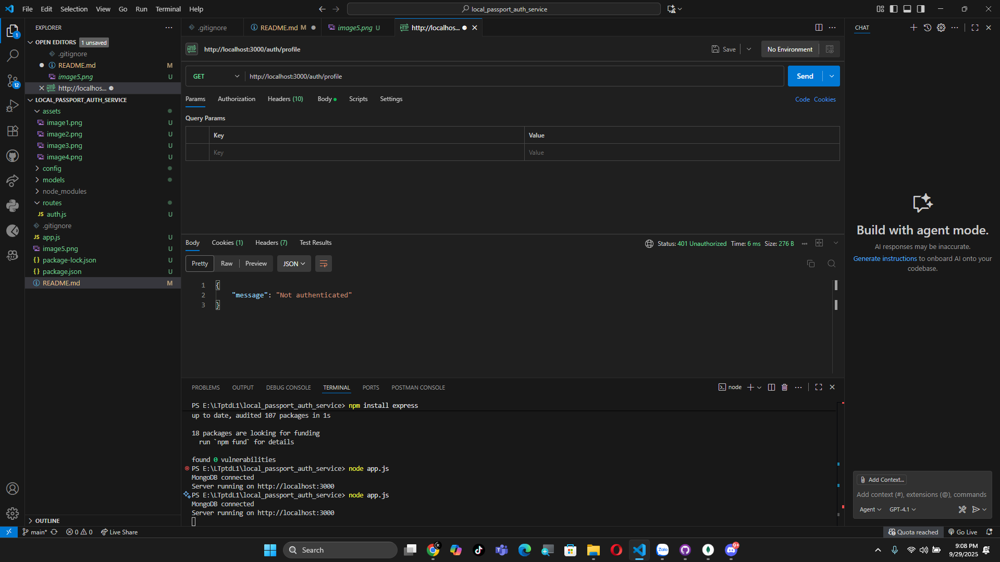

# 🔑 Local Passport Auth Service

---

## 📑 Quy trình demo

### 📝 Đăng ký tài khoản
- Người dùng thực hiện đăng ký:  
  

- Kiểm tra CSDL sau khi đăng ký:  
  

---

### 🔐 Đăng nhập
- Người dùng đăng nhập thành công:  
  

---

### 👤 Kiểm tra Profile
- Sau khi đăng nhập, có thể truy cập thông tin profile:  
  

---

### 🚪 Logout
- Người dùng thực hiện logout:  
  

---

### ⚠️ Truy cập profile khi chưa login
- Hệ thống từ chối truy cập khi chưa xác thực:  
  

---

✍️ *Demo phục vụ học tập về cơ chế Authentication với Passport.js (Local Strategy).*
